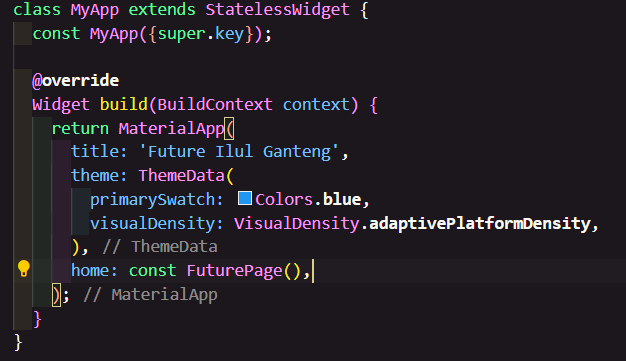
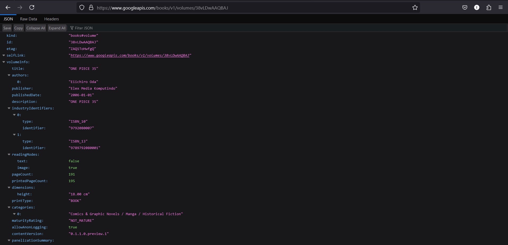
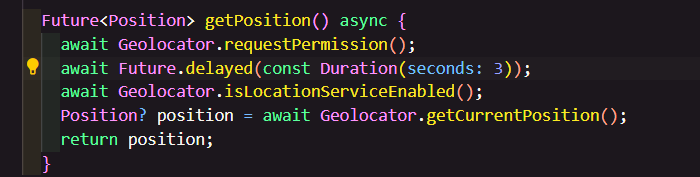
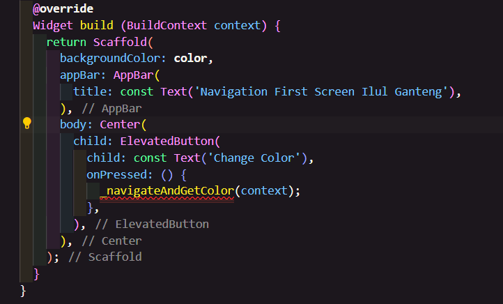
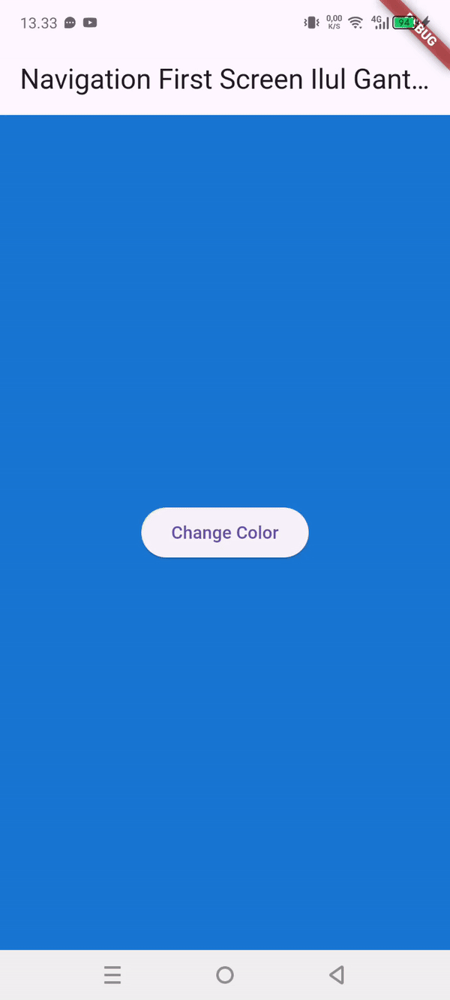
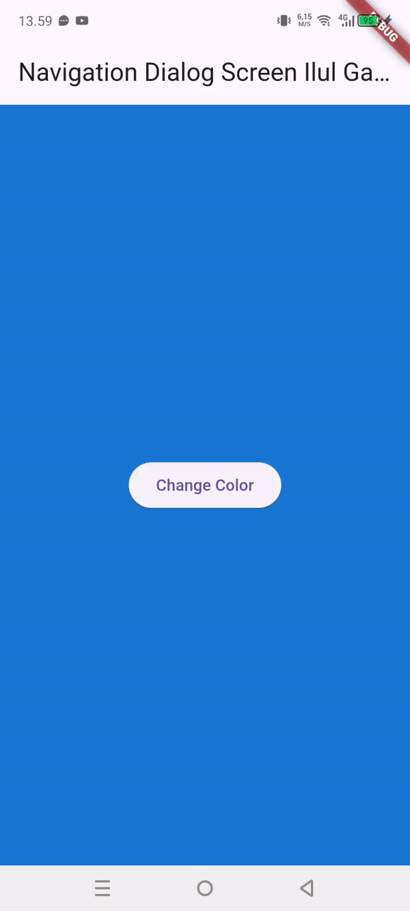

## Mochammad Cholilur Rokhman

## 2241720033 (15)

## TI-3H

### Praktikum 1: Mengunduh Data dari Web Service (API)

#### SOAL 1
W11 : SOAL 1

#### SOAL 2
W11 : SOAL 2

#### SOAL 3
W11 : SOAL 3 

Jelaskan maksud kode langkah 5 tersebut terkait substring dan catchError!

    substring digunakan untuk mengambil sebagian dari string
    catcherror digunakan untuk menangkap error

### Praktikum 2: Menggunakan await/async untuk menghindari callbacks

#### SOAL 4
W11 : SOAL 4  
Jelaskan maksud kode langkah 1 dan 2 tersebut!  

    Langkah 1 : 
    returnOneAsync() mengembalikan nilai 1 setelah 3 detik 
    returnTwoAsync() mengembalikan nilai 2 setelah 3 detik 
    returnThreeAsync() mengembalikan nilai 3 setelah 3 detik 

    Langkah 2 :
    fungsi count() menjalankan ketiga fungsi di atas secara berurutan kemudian menjumlahkan ketiga nilai yang dihasilkan kemudian mengubah nilai result menjadi total
  

### Praktikum 3: Menggunakan Completer di Future

#### SOAL 5
Jelaskan maksud kode langkah 2 tersebut!

    getNumber adalah fungsi yang mengembalikan nilai dari future
    calculate adalah fungsi yang menghitung nilai dari future
 
W11 : SOAL 5

#### SOAL 6

Jelaskan maksud perbedaan kode langkah 2 dengan langkah 5-6 tersebut!

    - fungsi pertama menggunakan async dan await, sedangkan fungsi kedua menggunakan try dan catch
    - fungsi pertama akan menunggu 5 detik sebelum mengembalikan nilai 42, sedangkan fungsi kedua akan menunggu 5 detik sebelum mengembalikan nilai 42, tetapi jika terjadi error, maka akan mengembalikan 'An error occurred'

W11 : SOAL 6

### Praktikum 4: Memanggil Future secara paralel

#### SOAL 7
W11 : SOAL 7

#### SOAL 8
W11 : SOAL 8  

Jelaskan maksud perbedaan kode langkah 1 dan 4!

    FutureGroup memungkinkan Anda menambahkan Future secara dinamis sebelum memproses hasilnya, sehingga cocok jika jumlah Future tidak diketahui di awal. Anda perlu secara eksplisit menutup grup dengan close() untuk menyelesaikan prosesnya, tetapi ini membutuhkan pustaka eksternal seperti async.

    Future.wait adalah fungsi bawaan Dart yang digunakan untuk menunggu sejumlah Future yang sudah diketahui di awal. Lebih sederhana dan langsung digunakan, tetapi tidak mendukung penambahan Future secara dinamis setelah pemrosesan dimulai.

### Praktikum 5: Menangani Respon Error pada Async Code

#### SOAL 9
W11 : SOAL 9

#### SOAL 10

W11 : SOAL 10

Jelaskan perbedaan kode langkah 1 dan 4!

    Kode pada langkah 1 menggunakan handleError() untuk menangani error secara langsung dengan blok try-catch, di mana error yang dilemparkan oleh fungsi returnError() ditangkap dan hasilnya diatur menggunakan setState(). Blok finally memastikan bahwa perintah tertentu (dalam hal ini, mencetak "Complete") selalu dijalankan, terlepas dari apakah terjadi error atau tidak. 
    Sedangkan returnError() hanya bertugas mensimulasikan sebuah proses asynchronous yang kemudian melemparkan sebuah Exception setelah penundaan 2 detik, tanpa menangani error tersebut.

### Praktikum 6: Menggunakan Future dengan StatefulWidget

#### SOAL 11
W11 : SOAL 11

#### SOAL 12

Jika Anda tidak melihat animasi loading tampil, kemungkinan itu berjalan sangat cepat. Tambahkan delay pada method getPosition() dengan kode await Future.delayed(const Duration(seconds: 3));

Apakah Anda mendapatkan koordinat GPS ketika run di browser? Mengapa demikian?

    Tidak, koordinat GPS tidak akan muncul saat dijalankan di browser karena paket geolocator lebih cocok untuk platform mobile seperti Android dan iOS. Browser membutuhkan izin melalui API geolokasi bawaan (navigator.geolocation) yang tidak sepenuhnya didukung oleh geolocator tanpa konfigurasi tambahan.

W11 : SOAL 12

### Praktikum 7: Manajemen Future dengan FutureBuilder

#### SOAL 13

Apakah ada perbedaan UI dengan praktikum sebelumnya? Mengapa demikian?

    FutureBuilder memberikan cara deklaratif untuk menangani data asinkron, sedangkan setState memerlukan pengelolaan manual. Hal inilah yang membuat tampilan dan logika asinkron lebih terintegrasi di praktikum ini.

W11 : SOAL 13

#### SOAL 14

Apakah ada perbedaan UI dengan langkah sebelumnya? Mengapa demikian?

    UI pada langkah ini menampilkan pesan "Something terrible happened!" jika terjadi error, sedangkan sebelumnya tidak ada penanganan error, sehingga UI akan kosong jika masalah muncul.

W11 : SOAL 14

### Praktikum 8: Navigation route dengan Future Function

#### SOAL 15

Tambahkan nama panggilan Anda pada tiap properti title sebagai identitas pekerjaan Anda.

#### SOAL 16

Cobalah klik setiap button, apa yang terjadi ? Mengapa demikian ?
Ketika tombol diklik, layar kembali ke Navigation First Screen dengan warna latar berubah sesuai tombol yang dipilih, karena nilai warna dikembalikan melalui Navigator.pop dan diperbarui dengan setState.

Gantilah 3 warna pada langkah 5 dengan warna favorit Anda!

W11 : SOAL 16

### Praktikum 9: Memanfaatkan async/await dengan Widget Dialog
### SOAL 17 
Cobalah klik setiap button, apa yang terjadi ? Mengapa demikian ?

    Saat setiap tombol ditekan, sebuah dialog muncul dengan pilihan warna. Ketika salah satu tombol warna dipilih, warna latar belakang aplikasi berubah sesuai pilihan. Berbeda dengan praktikum sebelumnya untuk praktikum ini dialognya menggunakan Navigator.pop untuk mengembalikan warna pilihan, dan perubahan tersebut diterapkan pada state aplikasi melalui setState().

Gantilah 3 warna pada langkah 3 dengan warna favorit Anda!

W11 : SOAL 17

