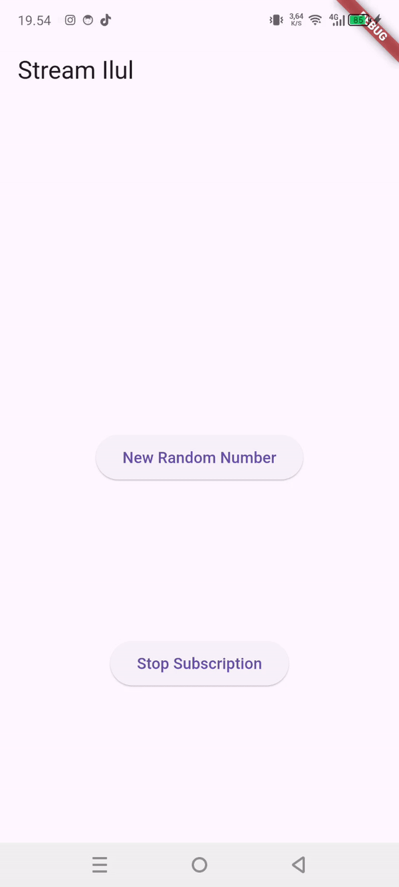

## Mochammad Cholilur Rokhman

## 2241720033 (15)

## TI-3H

### Praktikum 1: Dart Streams

#### SOAL 1

Tambahkan nama panggilan Anda pada title app sebagai identitas hasil pekerjaan Anda.

#### SOAL 2

Tambahkan 5 warna lainnya sesuai keinginan Anda pada variabel colors tersebut.

#### SOAL 3

Jelaskan fungsi keyword yield* pada kode tersebut!

    yield* digunakan untuk mengembalikan nilai dari stream yang diberikan oleh Stream.periodic

Apa maksud isi perintah kode tersebut?

    Kode tersebut merupakan kode yang digunakan untuk membuat stream yang akan mengeluarkan warna secara periodik setiap 1 detik sekali. Stream tersebut akan mengeluarkan warna dari list warna yang telah ditentukan.

#### SOAL 4
Capture hasil praktikum Anda berupa GIF dan lampirkan di README.

#### SOAL 5
Jelaskan perbedaan menggunakan listen dan await for (langkah 9) !

    Perbedaan utama antara listen dan await for adalah cara mereka menangani stream. Metode listen bersifat non-blocking, sehingga kode berikutnya tetap dieksekusi tanpa menunggu semua data diterima, cocok untuk memproses data secara real-time dengan callback. Sebaliknya, await for bersifat blocking dalam async function, sehingga menunggu seluruh data dari stream selesai diterima sebelum melanjutkan eksekusi, lebih cocok untuk proses sekuensial.

### Praktikum 2: Stream controllers dan sinks

#### SOAL 6

Jelaskan maksud kode langkah 8 dan 10 tersebut!

    - Kode pada langkah 8 menginisialisasi sebuah stream untuk mendengarkan perubahan data pada stateful widget. Pada fungsi initState, sebuah objek NumberStream dibuat bersama dengan controller-nya (NumberStreamController). Kemudian, stream dari controller tersebut didaftarkan menggunakan listen, sehingga setiap kali ada data baru (event) yang diterima, fungsi callback akan dipanggil untuk memperbarui nilai lastNumber melalui setState. Ini memungkinkan tampilan untuk secara dinamis menampilkan nilai terbaru dari stream.
    - Kode pada langkah ke 10 fungsi yang menghasilkan angka acak antara 0 hingga 9 dan menambahkannya ke sink milik sebuah stream. Fungsi addRandomNumber menggunakan objek Random untuk menghasilkan angka acak (myNum) dengan metode nextInt(10), lalu memanggil metode addNumberToSink dari numberStream untuk mengirimkan angka tersebut ke stream. Angka yang ditambahkan ini nantinya dapat diterima oleh listener yang terdaftar pada stream.

#### SOAL 7
Jelaskan maksud kode langkah 13 sampai 15 tersebut!

    - Kode pada langkah ke 13 berfungsi untuk menambahkan kesalahan (error) ke dalam stream. Dengan memanggil controller.sink.addError('error'), pesan 'error' dikirimkan sebagai kesalahan kepada semua listener yang mendengarkan stream tersebut. Hal ini berguna untuk mensimulasikan atau menangani skenario error dalam alur data stream.
    - Kode pada langkah ke 14 mendengarkan data dari sebuah stream menggunakan listen, di mana setiap data baru (event) yang diterima akan memperbarui nilai lastNumber melalui setState. Jika terjadi kesalahan selama proses (error), callback pada onError akan dipanggil untuk mengatur lastNumber menjadi -1, menunjukkan adanya kesalahan. Hal ini memastikan aplikasi dapat menangani data normal maupun kesalahan dari stream.
    - Kode pada langkah ke 15 berfungsi yang menambahkan sebuah error ke stream menggunakan metode addError milik numberStream. Tidak seperti data biasa, error ini akan diterima oleh listener atau subscriber yang terdaftar sebagai sebuah kejadian error, sehingga bisa digunakan untuk mengelola atau menangani situasi khusus seperti kesalahan selama pengolahan data pada stream.

### Praktikum 3: Injeksi data ke streams

#### SOAL 8

Jelaskan maksud kode langkah 1-3 tersebut!

    Kode diatas menggunakan sebuah StreamTransformer untuk memproses data dari stream sebelum diteruskan ke listener. Transformer ini mengalikan setiap nilai yang diterima dengan 10 menggunakan handleData, menangani kesalahan dengan mengirimkan nilai -1 melalui handleError, dan menutup sink saat stream selesai melalui handleDone. Stream yang telah diubah (transform) didengarkan dengan listen, yang memperbarui lastNumber setiap kali ada data baru atau kesalahan dengan nilai yang sesuai.

### Praktikum 4: Subscribe ke stream events

#### SOAL 9

Jelaskan maksud kode langkah 2, 6 dan 8 tersebut!

    - Kode pada langkah ke 2 yaitu ini Di dalam fungsi initState, sebuah objek NumberStream dibuat, yang memiliki controller sebagai sumber data. Sebuah stream didaftarkan ke controller.stream, dan mendengarkan setiap perubahan data dengan metode listen. Ketika ada data baru (event) pada stream, widget diperbarui menggunakan setState untuk memperbarui nilai lastNumber. Fungsi super.initState() memastikan state widget diinisialisasi dengan benar.
    - Kode pada langkah ke 6 ini digunakan untuk menghentikan subsciption terhadap stream yang sedang didengarkan. Metode ini agar mencegah kebocoran memory.
    - Kode pada langkah ke 8 ini yaitu Fungsi addRandomNumber digunakan untuk menghasilkan angka acak antara 0 hingga 9 menggunakan kelas Random. Angka tersebut kemudian ditambahkan ke stream melalui metode addNumberToSink pada objek numberStream, jika numberStreamController belum ditutup (!isClosed). Jika controller sudah ditutup, fungsi mengubah nilai lastNumber menjadi -1 melalui setState, menandakan bahwa tidak ada angka yang dapat ditambahkan ke stream. Fungsi ini memastikan hanya data valid yang ditambahkan ke stream selama masih aktif.

### Praktikum 5: Multiple stream subscriptions

#### SOAL 10

Jelaskan mengapa error itu bisa terjadi ?
    
    Terjadi error karena terdapat dua langganan (subscriptions) secara bersamaan untuk satu stream (stream.listen). Pada stream default di Dart (non-broadcast stream), hanya satu pendengar (listener) yang diizinkan pada satu waktu. Jika menambahkan pendengar kedua seperti pada subscription2, akan muncul error "Stream has already been listened to".

#### SOAL 10

Jelaskan mengapa hal itu bisa terjadi ?

    Karena asBroadcastStream() digunakan untuk mengubah single-subscription menjadi broadcast stream, yang awalnya hanya satu pendengar sekarang dapat digunakan untuk banyak pendengar.

### Praktikum 6: StreamBuilder

#### Soal 12

Jelaskan maksud kode pada langkah 3 dan 7 !

    - Kode pada langkah ke 3 terdapat sebuah class NumberStream dengan metode getNumbers, yang menghasilkan sebuah stream asinkron (Stream<int>). Metode ini menggunakan fungsi Stream.periodic untuk menghasilkan data secara berkala, yaitu setiap 1 detik (Duration(seconds: 1)). Pada setiap interval, sebuah angka acak antara 0 hingga 9 dibuat menggunakan kelas Random dan dikembalikan oleh stream. Operator yield* memastikan angka-angka tersebut diteruskan sebagai output dari stream, sehingga dapat didengarkan oleh pendengar (listener).
    - Kode pada langkah ke 7 digunakan untuk membangun UI secara dinamis berdasarkan data dari sebuah stream (numberStream). StreamBuilder mendengarkan perubahan data pada stream, dengan nilai awal yang diatur melalui initialData: 0.

### Praktikum 7: BLoC Pattern

#### Soal 13

Jelaskan maksud praktikum ini ! Dimanakah letak konsep pola BLoC-nya ?

    Praktikum ini bertujuan untuk memahami dan menerapkan pola BLoC (Business Logic Component). Pola BLoC berfungsi untuk memisahkan logika dari antarmuka pengguna, sehingga aplikasi menjadi lebih terorganisir dan mudah dikembangkan. Pada praktikum ini, logika untuk menghasilkan angka acak diimplementasikan dalam kelas RandomNumberBloc, sedangkan pengelolaan antarmuka dilakukan pada file random_screen.dart.
    Penerapan pola BLoC terlihat dari bagaimana logika dan antarmuka saling berinteraksi menggunakan stream. Saat tombol di antarmuka ditekan, sinyal event dikirimkan ke BLoC melalui metode generateRandom. BLoC kemudian memproses sinyal tersebut, menghasilkan angka acak, dan mengirimkan hasilnya kembali ke antarmuka melalui stream. Antarmuka memanfaatkan StreamBuilder untuk mendengarkan data dari BLoC dan secara otomatis memperbarui tampilan berdasarkan data yang diterima.

