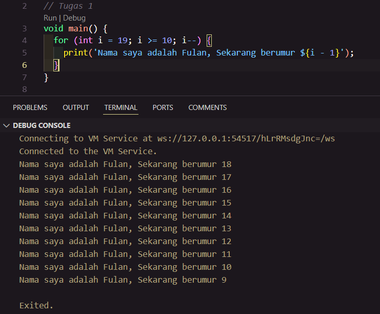
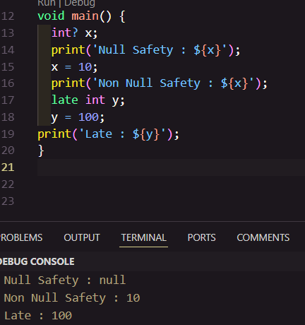

## Mochammad Cholilur Rokhman

## 2241720033 (15)

## TI-3H

### Tugas

#### Soal

1. Modifikasilah kode pada baris 3 di VS Code atau Editor Code favorit Anda berikut ini agar mendapatkan keluaran (output) sesuai yang diminta!
2. Mengapa sangat penting untuk memahami bahasa pemrograman Dart sebelum kita menggunakan framework Flutter ? Jelaskan!
3. Rangkumlah materi dari codelab ini menjadi poin-poin penting yang dapat Anda gunakan untuk membantu proses pengembangan aplikasi mobile menggunakan framework Flutter.
4. perbedaan Null Safety dan Late variabel berikan contoh kode perogramnya pada dart !

#### Jawaban

1. 
2. Karena Dart adalah bahasa pemrograman yang digunakan untuk membuat aplikasi Flutter. Jadi, jika kita ingin membuat aplikasi Flutter,kita harus memahami Dart terlebih dahulu.
3. Dart dirancang untuk object-oriented (OO). Secara singkat, Bahasa OOP didasarkan pada konsep objek yang menyimpan kedua data (disebut fields) dan kode (disebut methods). Objek-objek ini dibuat dari cetak biru yang disebut class yang mendefinisikan field dan method yang akan dimiliki oleh sebuah objek.

    a. x.==(y) metode untuk melakukan perbandingan kesetaraan

    b. Arithmetic operators

       - (+) untuk tambahan
       - (-) untuk pengurangan
       - (*) untuk perkalian
       - / untuk pembagian
       - ~/ untuk pembagian bilangan bulat
       - % untuk operasi modulus
       - -expression untuk negasi

    c. Increment dan Decrement operators

       - ++var atau var++ untuk menambah nilai variabel var sebesar 1
       - --var atau var-- untuk mengurangi nilai variabel var sebesar 1

    d. Equality and retional operators

       - == untuk memeriksa apakaha operan sama
       - != untuk memeriksa apakah operan berbeda
       - (>) memeriksa apakah opersan kiri lebih besar dari operan kanan
       - (<) memeriksa apakah operan kiri lebih kecil dari operan kanan
       - (>=) memeriksa apakah operan kiri lebih besar dari atau sama dengan operan kanan
       - (<=) memeriksa apakah operan kiri kurang dari atau sama dengan operan kanan
        
    e. Logical operators
    
       - !expression negasi atau kebalikan hasil eksekusi-yaitu, true menjadi false dan false menjadi true
       - || menerapkan operasi logika OR antara dua ekspresi
       - && menerapkan operasi logika AND antara dua ekspresi

4. Null Safety adalah fitur yang memungkinkan kita untuk menangani nilai null dengan aman Sedangkan Late variabel adalah variabel yang nilainya bisa diinisialisasi setelah variabel tersebut dideklarasikan.
   
   Contoh kode program : 
