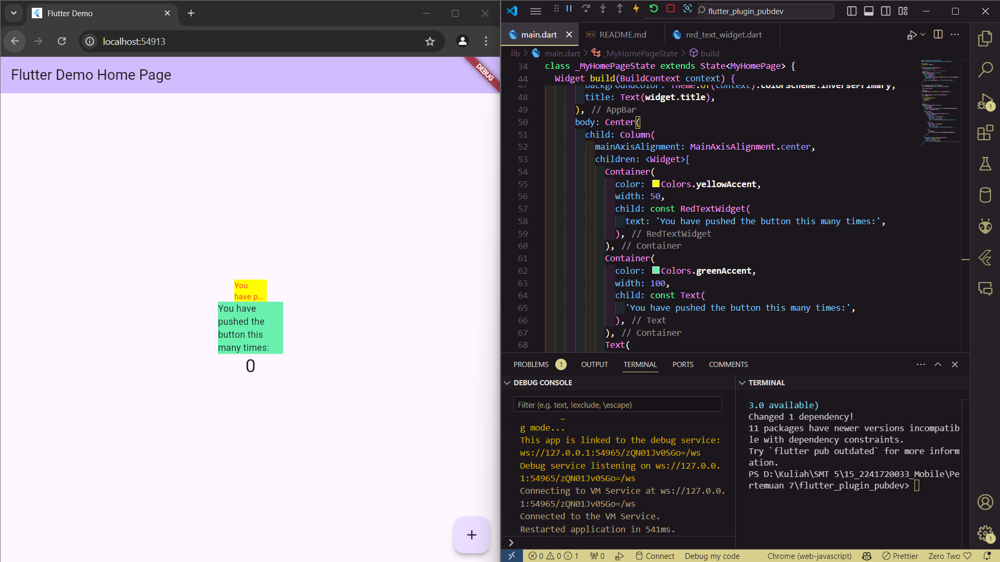

## Mochammad Cholilur Rokhman

## 2241720033 (15)

## TI-3H

### Praktikum Menerapkan Plugin di Project Flutter

Hasil : 

### Tugas Praktikum 

#### Soal 

1. Selesaikan Praktikum tersebut, lalu dokumentasikan dan push ke repository Anda berupa screenshot hasil pekerjaan beserta penjelasannya di file README.md!
2. Jelaskan maksud dari langkah 2 pada praktikum tersebut!
3. Jelaskan maksud dari langkah 5 pada praktikum tersebut!
4. Pada langkah 6 terdapat dua widget yang ditambahkan, jelaskan fungsi dan perbedaannya!
5. Jelaskan maksud dari tiap parameter yang ada di dalam plugin auto_size_text berdasarkan tautan pada dokumentasi ini !
6. Kumpulkan laporan praktikum Anda berupa link repository GitHub kepada dosen!

#### Jawaban 

1. Sudah Selesai
2. Maksud dari langkah 2 adalah untuk menambahkan package auto_size_text ke dalam project flutter yang sedang dikerjakan.
3. Pada langkah tersebut, terdapat parameter text yang bertipe String dan wajib diisi ketika membuat objek dari class RedTextWidget. Hal ini dikarenakan parameter text memiliki kata kunci required. Kata kunci required
4.  Widget pertama adalah RedTextWidget yang merupakan custom widget yang kita buat sendiri sedangkan Widget kedua adalah Text yang merupakan widget bawaan dari Flutter  .
Perbedaan dari kedua widget tersebut adalah RedTextWidget memiliki style yang sudah ditentukan sedangkan Text memiliki style default yang tidak bisa diubah.
5. 
    a. Key : Properti ini mengontrol bagaimana satu widget menggantikan widget lain di pohon widget.  
    b. style : Properti ini digunakan untuk mendefinisikan tampilan visual dari sebuah widget. Misalnya, dalam widget Text, properti style akan digunakan untuk menentukan font, ukuran, warna, dan fitur tipografi lainnya dari teks. Biasanya mengambil objek TextStyle.  
    c. textAlign : Properti ini menentukan bagaimana teks harus disejajarkan secara horizontal di dalam wadahnya. Nilai umum termasuk TextAlign.left, TextAlign.right, TextAlign.center, dan TextAlign.justify.  
    d. textDirection : Properti ini menunjukkan arah aliran teks. Ini dapat diatur ke TextDirection.ltr (kiri-ke-kanan) atau TextDirection.rtl (kanan-ke-kiri). Ini sangat penting untuk mendukung bahasa yang dibaca dalam arah yang berbeda.  
    e. locale : Properti ini mendefinisikan lokal di mana teks harus ditampilkan. Lokal mempengaruhi bagaimana teks diformat dan ditampilkan, seperti format tanggal, format angka, dan arah teks.  
    f. softWrap : Properti ini menentukan apakah teks harus dipotong pada titik-titik pemotongan lunak. Jika diatur ke true, teks akan membungkus ke baris berikutnya pada titik-titik pemotongan lunak. Jika diatur ke false, teks akan meluap dari wadahnya.  
    g. overflow : Properti ini mengontrol bagaimana luapan visual harus ditangani. Misalnya, jika teks terlalu panjang untuk muat di dalam wadahnya, properti overflow dapat diatur ke nilai seperti TextOverflow.clip, TextOverflow.fade, atau TextOverflow.ellipsis untuk mengelola perilaku luapan.  
    h. textScaleFactor : Properti ini menentukan faktor skala untuk teks. Ini memungkinkan Anda untuk menyesuaikan ukuran teks relatif terhadap ukuran font default. Misalnya, textScaleFactor sebesar 1,5 akan membuat teks 50% lebih besar dari ukuran default.  
    i. semanticLabel : Properti ini menyediakan deskripsi semantik dari widget, yang dapat digunakan oleh alat aksesibilitas untuk menggambarkan tujuan atau konten widget kepada pengguna dengan disabilitas. Ini penting untuk membuat aplikasi dapat diakses oleh semua pengguna.

